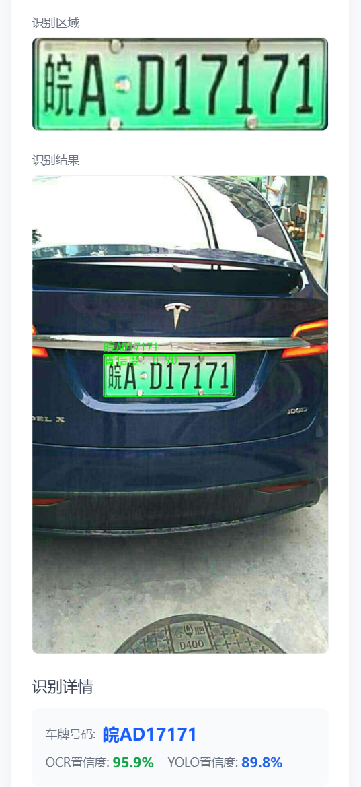
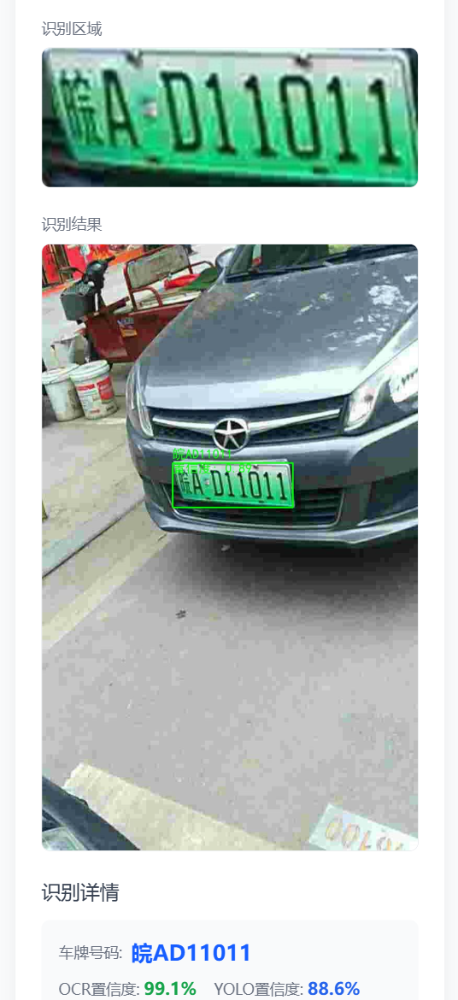

# 车牌识别演示系统

> [PaddleOCR 文档](https://www.paddleocr.ai/main/)
>
> [Ultralytics YOLO 文档](https://docs.ultralytics.com/zh/)

本项目是一个验证自训练车牌区域检测模型，并对检测区域进行ORC识别的一个演示项目；目前识别模型仅对中国绿牌和蓝牌数据集进行训练。数据集来源：https://github.com/detectRecog/CCPD

本项目提供两个服务：

1. 图片识别服务 - 提供车牌识别API
2. 静态文件服务 - 提供前端界面和文件访问

## 项目结构

```
./
├── controllers/      # 控制器层
├── services/         # 服务层
├── models/           # 模型目录（YOLO模型）
├── utils/            # 工具函数
├── static/           # 静态文件
├── uploads/          # 上传文件目录
├── app.py            # 识别服务主文件
├── static_server.py  # 静态文件服务主文件
├── requirements.txt  # 依赖文件
├── .env			  # 环境变量配置文件
└── README.md         # 项目说明
```

## 环境要求

- Python 3.10
- 依赖包见 requirements.txt

## 安装依赖

```bash
# 创建虚拟环境
python -m venv venv
# Windows激活环境
venv\Scripts\activate
# Linux/macOS激活环境
source venv/bin/activate
```

特定版本的依赖（CPU环境，需要支持AVX指令集）

```shell
# 卸载当前 torch 并安装兼容版本 CPU版本
pip uninstall torch torchvision torchaudio
pip install torch torchvision torchaudio --index-url https://download.pytorch.org/whl/cpu

# 安装paddlepaddle CPU版本
pip uninstall paddlepaddle paddleocr -y
python -m pip install paddlepaddle==3.2.0 -i https://www.paddlepaddle.org.cn/packages/stable/cpu/
pip install paddleocr==3.3.0 -i https://pypi.tuna.tsinghua.edu.cn/simple
```

接着其他依赖

```
pip install -r requirements.txt -i https://pypi.tuna.tsinghua.edu.cn/simple
```

## 运行服务

### 1. 启动图片识别服务（端口8000）

```bash
python app.py
```

服务将在 http://localhost:8000 运行

### 2. 启动静态文件服务（端口8001）

在另一个终端中运行：

```bash
python static_server.py
```

服务将在 http://localhost:8001 运行


### 3.识别效果

1. 访问 http://localhost:8001
2. 上传车辆图片
3. 点击「开始识别」按钮
4. 查看识别结果




## API接口

### 车牌识别接口

- URL: `http://localhost:8000/api/recognize`
- 方法: POST
- 请求体: 图片文件（multipart/form-data）
- 响应格式: JSON

#### 成功响应示例

```json
{
  "success": true,
  "data": {
    "results": [
      {
        "number_plate": "京A12345",
        "confidence": 0.95,
        "coordinates": {
          "x1": 100,
          "y1": 200,
          "x2": 300,
          "y2": 250
        }
      }
    ],
    "original_image": "/uploads/original_123456789.jpg",
    "result_image": "/uploads/result_123456789.jpg",
    "message": "识别成功"
  }
}
```

#### 失败响应示例

```json
{
  "success": false,
  "error": "识别失败的原因"
}
```


## 注意事项

1. 确保两个服务同时运行
2. 首次运行时会下载必要的模型文件
3. 上传文件会保存在 uploads 目录中
4. 如需使用自定义YOLO模型，请将模型文件放入 models/best.pt